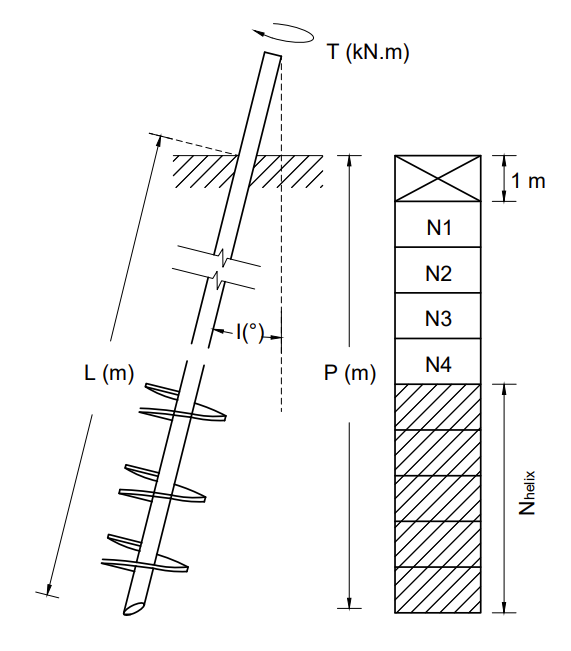

```{r setup, include=FALSE}
knitr::opts_chunk$set(echo = TRUE)
```

```{r , include=FALSE}
setwd("D:/LabGeo/Documents/03 - Drive/00 - 4 Semestre ITA/29 - Github_Manuscript/R in latex")
```

```{r, include=FALSE}
library(dplyr) 

library(readr) 

library(zoo) 

library(caret) 

library(ggplot2)

library(Metrics) 

library(ggpubr) 

library(xtable) 

library(caretEnsemble)

library(tidyverse)

library(GGally)

library(corrplot)

library("plot3D")

library(xtable)

library(gridExtra)

library(MLmetrics)
```

# Sobre o Autor {-}

Aqui posso criar algum texto


\newpage


# Introduction

Helical piles are composed of steel circular plates welded to a central shaft, which usually has a tubular or a square solid cross section. Usually, the helical plates are equally spaced, with equal or increasing diameter from the tip to the top of the pile. Helical piles are installed into the ground at a constant rotation rate associated with a vertical downward (crowd) force mainly at the initial depths. It is recommended to proceed the pile penetration at a vertical advance of approximately one helix pitch length each rotational cycle, which aims at minimizing the penetrated soil disturbance \cite{mitsch1985uplift,GhalyHanna1991,lutenegger2019screw,elsherbiny2013axial}. A torque indicator is coupled between the hydraulic motor and pile to measure the torque values during installation and, therefore, the pile capacity can be estimated via torque-to-capacity correlations \cite{hoy89}.

The use of helical piles began in Brazil in the late 1990s, serving mainly as anchors for cables of guyed transmission towers, therefore, subjected to tensile loading \cite{tsuha2015helical}. Their use increased in the following years \cite{tsuha2007modelo}, which could be attributed to characteristics such as fast and easy installation, possibility of immediate loading after driving \cite{lutenegger2011historical}, negligible vibration and noise during installation, and the possibility of estimating load capacity from the torque values measured at the end of the installation \cite{per09}.

Several methods are available in the literature to estimate the pile capacity \cite{hoy89}, including a recent study that applies machine learning techniques for tdesignhis purpose \cite{wan19}. Additionally, the empirical correlation between torque and uplift capacity (\emph{K\textsubscript{t}} method) is an approach usually adopted in the practice of validating the pile installation depth \cite{per09}. Since correlation between torque and pile capacity is well developed in the literature \cite{GhalyHanna1991}, some studies seek to predict torque as an indirect way to determine the pile capacity using, for example, information from the cone penetration test \cite{spagnoli2018estimation}. Nonetheless, in most Brazilian projects, the only \emph{in situ} test available is the Standard Penetration Test (SPT).

In this context, the objective of this work is to apply eight machine learning techniques to produce models capable of predicting helical piles installation torque from basic preliminary design information, which includes only SPT as $in$ $situ$ test. This is an extension of the study of \cite{silva2018estimativa}, which used linear regressions applied to a similar dataset. To improve the model accuracy, new variables are obtained from raw data. The performance of different machine learning techniques is compared using the mean absolute error (MAE) the root of the mean squared error (RMSE) and the coefficient of determination ($R^2$). The variable importance is measured using the three best performing models, which are also evaluated using the concept of confidence interval. 


\newpage

# General methodology

The methodology proposed to obtain the final machine learning models to be used is divided into three basic steps:

\begin{itemize}
    \item Pre-processing,
    \item Machine learning techniques calibration and
    \item Evaluation of models.
\end{itemize}

The strategies employed into each of these steps are summarized hereafter. This Section also presents brief concepts of multiple linear regression and variable importance.

# Pre-Processing

The raw dataset used in this study contains information from the tower foundations construction on a 350 kilometer stretch of a power transmission line located between the towns Paranatinga and Cláudia, Mato Grosso State, Central-West Region of Brazil. The region presents a very diversified geological context. Sandy sediments, partially covered by a sand-clay layer, predominate the northern portion of this region. In the southern portion, old rocks and recent sediments are found \cite{ross1982geomorfologia}. The predominant soil types in the study area are latosols, eutrophic podzolic, cambisol, hydromorphic laterite, low humic glei, quartz sands, alluvial soils, litholic soils and concretion soils. The great variety of soils is a result of the geomorphological units diversity and lithologies found in the study area \cite{barros1982projeto}.

The information on soil type was provided on the SPT reports firstly used for the transmission line design. The soil classification was based upon information on particle size (sieve analysis), soil plasticity, color, and soil formation (e.g. sedimentary, residual), with such procedures established in the Brazilian standard for SPT test. Most samples were identified as clayey sand (65.8\%), followed by clayey silt (13.8\%), sandy silt (9.6\%), sandy clay (5.9\%), and sand (0.3\%). Fig. \ref(fig: fig-1) XXXXXXX presents the SPT blow counts occurrence (hereinafter referred to as SPT index) versus depth. The SPT tests were carried out according to the Brazilian standard \cite{nbr6484}, which describes a testing procedure similar to the international procedure \cite{astm20081586} . For Brazilian standards equipment, the SPT efficiency ranges between 70 and 80\%, 72\% the most common value \cite{lukiantchuki2017energy} and, therefore, this is the considered value at this work.

The helical piles installed in the study area were comprised of a 101,6 mm diameter steel tubular shaft and six helical plates with diameters of 254, 305, 366, 366, 366, and 366 mm, with increasing diameter from the tip to the top of the pile. The helix spacing was three times the diameter of the smaller helix \cite{silva2018estimativa}. The piles were installed using a hydraulic drive head attached to a backhoe loader. The torque measurement at each meter of pile penetration was provided by a torque indicator coupled between the driving head and the pile top. The pile advance rate was not included in the installation reports. In addition to soil type and SPT information, the raw dataset used in this study includes 707 helical piles installation torque, the pile inclination and the pile final length.


```{r, include=FALSE}

source("processo_total.R")

source("numero_solos.R")

source("unir_bd.R")

source("encode_solos.R")

source("Resultado_teste.R")
```


```{r , include=FALSE}

Bruto <- read_csv("Bruto.csv")

processo_total <- Processo_Total(Bruto)

NSPT_Torres <- read_delim("NSPT_Torres.csv", 
                          ";", escape_double = FALSE, trim_ws = TRUE)

solos <- numero_solos(NSPT_Torres)

Solos_BD <- unir_bd(processo_total,solos)

df_solos <- Solos_BD


df_solos$SOLO2[df_solos$SOLO == "Areia argilosa"] <- "Clayey sand"
df_solos$SOLO2[df_solos$SOLO == "Silte argiloso"] <- "Clayey silt"
df_solos$SOLO2[df_solos$SOLO == "Silte arenoso"] <- "Sandy silt"
df_solos$SOLO2[df_solos$SOLO == "Argila arenosa"] <- "Sandy clay"
df_solos$SOLO2[df_solos$SOLO == "Argila"] <- "Clay"
df_solos$SOLO2[df_solos$SOLO == "Areia"] <- "Sand"

Total_BD <- encode_solos(Solos_BD)

base_Total <- Total_BD[order(Total_BD$TORRE, Total_BD$PE,Total_BD$CONTADOR),]

base_Total
```


```{r, include=FALSE}

data_ml <- select(base_Total,1:4,6:20,-13,-14,5)

nome_data <- c("Contador","Torre","Pe","NSPTponta","Profundidade","NSPThelice","Nfuste","N1","N2","N3","N4","S1","S2","S3","S4","S5","S6", "Torque")

colnames(data_ml) <- nome_data

data_ml <- data_ml %>% group_by(Torre, Pe) %>% arrange(Torre)

head(data_ml,20)

```


```{r, include=FALSE}

varmanuscript <- data_ml[,c(5,4,18)]
colnames(varmanuscript)

colnames(varmanuscript) <- c("Penetration","NSPTtip","Torque")

ggplot(varmanuscript, aes(x=Penetration,y=NSPTtip, color=Torque))+
  geom_point()+
  labs(x="Penetration (m)",y="SPT index") + theme_minimal()+
  scale_colour_gradient(low = "white", high = "black")

```

```{r fig-1, fig.width=5,fig.cap = "SPT index values versus occurrence depth", echo = FALSE }
ggplot(varmanuscript, aes(x=Penetration,y=NSPTtip, color=Torque))+
  geom_point()+
  labs(x="Penetration (m)",y="SPT index") + theme_minimal()+
  scale_colour_gradient(low = "white", high = "black")
```

The first dataset assembled, which totaled `r nrow(Bruto)` samples, was pre-processed to improve the machine learning techniques performance. Each sample correspond to a torque value for a specific pile number (identification) with a specific penetrated length, which consequently can be associated with the soil type and the SPT index.

The first concern is cleaning data to eliminate errors like missing values and inconsistencies, a procedure that reduced the original dataset to `r nrow(data_ml)` samples. Next, variables must be chosen as inputs for predicting the installation torque.

The variable $P$ refers to the pile tip depth at the moment in which torque is measured, as shown in Fig. XXXXXX. The variable $NSPT_{tip}$ represents the SPT index at the pile tip depth. The so called Initial Dataset is composed only of these two inputs plus the measured torque, which is simply referred to as $Torque$. Table xxxxxx presents an Initial Dataset sample.

```{r, echo=FALSE}

data_initial <- data_ml[,c(5,4,18)]

colnames(data_initial) <- c("Penetration","NSPTtip","Torque")

knitr::kable(head(data_initial,10), caption = "Initial Dataset sample")

```



Other proposed inputs are $N_1$, $N_2$, $N_3$ and $N_4$, representing the SPT index of first 4 meter depth after excluding the first meter (see Fig. XXXXXXXX). It is well known in the Brazilian practice that the pile penetration causes a gap around the pile shaft with at least 1 meter depth in the ground. Therefore, the soil contribution to the torque at 1 meter depth is disregarded. 

The soil type is also included using six predefined classes, represented by the binary variables $S_1$, $S_2$, $S_3$, $S_4$, $S_5$ and $S_6$. These soil types and their encoding are listed in Table XXXXXX. The mean SPT index for each depth of helical plates is also included as the input $NSPT_{helix}$. The variable $N_{shaft}$ is the summation of all SPT indexes measured above the helical plates, representing the shaft resistance. The Initial Dataset combined with these new inputs constitutes the so called Complete Dataset, with 14 inputs. All these variables and the output $Torque$ are summarized in Table 

The pre-processing final step is evaluating input correlation, it measures the association between variable pairs. Values close to $\pm 1$ indicate perfectly related variables, while $0$ indicate they are independent. Highly correlated inputs should be avoided because they cause redundancies that can destabilize regression techniques \cite{kuhn2013applied}.
In this work, all correlation indexes belong to the interval $\left [ -0.9,0.9 \right ]$, which can be considered reasonable \cite{james2013introduction}. This is illustrated in Fig. XXXXX, which shows the so called correlation matrix for the Complete Dataset.


```{r fig-3,fig.cap = "Correlation between variables", echo = FALSE }
data_paper <- data_ml[,c(4:18)]

names(data_paper)[names(data_paper) == "NSPTponta"] <- "NSPTtip" 

names(data_paper)[names(data_paper) == "Profundidade"] <- "P"

names(data_paper)[names(data_paper) == "NSPThelice"] <- "NSPThelix"

names(data_paper)[names(data_paper) == "Nfuste"] <- "Nshaft"

basecorrpaper <- data_paper
correlacao_spearman_paper <- cor(basecorrpaper,method="spearman")


corrplot(correlacao_spearman_paper,
         method = "color",
         #col = gray.colors(100), #escala de cinza
         type = "upper", # somente a parte de cima
         #method = "pie", # estilo torta
         tl.cex = 0.8, # tamanho do texto t?tulos
         number.digits = 3, # numero de digitos
         addCoef.col = "black",
         tl.col="black", # cor dos titulos em preto
         number.cex = .5,# tamanho texto coeficientes
         tl.srt = 45 # inclinação rótulos
         )

```


Many other inputs were considered in this study; however, they are omitted here for conciseness sake. The ones selected to be presented in this section are those that provided the most interesting conclusions, including the most accurate results. It was also considered that the three main parts of the helical pile (shaft above helical plates, helical plates region and pile tip) should be well represented. Further detail such as different helix diameter was not considered, because it would require knowing the rupture mechanism during installation.

# Machine Learning Techniques Calibration

The dataset is divided into  two stages, named training and test. The first is used to calibrate the machine learning techniques and the second is used to measure their performance. Considering literature recommendations \cite{james2013introduction}, 80\% of all examples are used for training and 20\% for the testing stage in this work.

The machine learning techniques performance is evaluated using a cross-validation strategy \cite{goetz2015evaluating}. In this strategy, the training dataset is randomly divided into $k$ folds of the same size. In each cross-validation step, one fold is separated for evaluation without replacement, while the remaining $k-1$ folds are used for training. All folds are evaluated after $k$ steps and the overall performance is considered through the individual performances mean \cite{james2013introduction}. In this work, $k=3$ was fixed after initial tests, as presented by Fig.xxxxx . The training dataset is divided into $15$ folds for better visualization of the procedure.

```{r,include=TRUE, fig.align="center", fig.cap=c("Cross validation with k=3"), echo=FALSE}

knitr::include_graphics("Fig4.pdf")

```


The same performance measures are used to calibrate the machine learning techniques during training and testing \cite{james2013introduction}. Next Section presents these measures.

# Evaluating the Models

After calibration, the machine learning models are tested to estimate torque for new data. The testing dataset, which represents 20\% of the main dataset, is kept apart from the training procedures to reproduce practical situations in which the new data is completely unknown. For both, training and test, the metrics described below use inputs $x_i$ to compare the predictions $f(x_i)$ with the known target values $y_i$.

The mean absolute error $MAE$ is calculated using the absolute difference between known and predicted values. For $n$ examples, it can be obtained by
\begin{equation} \label{eq:mae}
MAE = \frac{\sum_{i=1}^{n}|y_i-f(x_i)|}{n}
\end{equation}

The root of the mean squared error $RMSE$ represents the standard deviation of the difference between the observed and predicted values, using
\begin{equation}\label{eq:rmse}
RMSE = \sqrt{\frac{1}{n}\sum_{i=1}^{n}(y_i-f(x_i))^2}
\end{equation}

Finally, the coefficient of determination $R^2$ is a dimensionless measure that represents the correlation between predicted and observed values. It can be written as
\begin{equation} \label{eq:rsquared}
   R^2=\frac{\sum_{i=1}^{n}(y_i-f(x_i))^2}{\sum_{i=1}^{n}(y_i-\bar{y_i})^2}
\end{equation}

where
\begin{equation} \label{eq:averagey}
   \bar{y}=\frac{1}{n}\sum_{i=1}^{n}y_i
\end{equation}

These measures serve not only to evaluate the performance of the models during the testing stage, but also to evaluate their generalization during the training stage. Very precise values in training when compared to the test can indicate overfitting, which means that even noisy data from the training dataset is being reproduced by the model. An over specialized model tends to become inaccurate when applied to new data. On the other hand, the model losing trends during training indicates underfitting. It means the model is ignoring important information from the training dataset, which also compromises generalization.

Models are calibrated in training using hyperparameters, which are specific configurations for each machine learning technique. One strategy to set these hyperparameters is training several models with random values and choose the one with the best accuracy. However, this strategy is not practical and tends to result in high computational cost. An alternative is the so called "pick the best" technique \cite{kuhn2013applied}, which randomly chooses different parameters in training, decreasing the computational cost to adjust the parameters.

# Multiple Linear Regression -- LM

Linear regressions work minimizing error to approximate data using linear functions. Eq. \ref{eq:linear} represents its general form:
\begin{equation}\label{eq:linear}
    f(x_i)= \alpha + \beta.x_i
\end{equation}
where $x_i$ represent the input, $f(x_i)$ is the output and $\alpha$ and $\beta$ represent parameters to be calibrated. The best fit corresponds to the solution of an optimization problem for minimizing error. Using the least squares technique, the error $J$ is measured using Eq. \ref{eq:J}:
\begin{equation} \label{eq:J}
       J=\sum_{i=1}^{n}(y_i -f(x_i))^2
\end{equation}

where $n$ is the number of examples. Fig. \ref{fig:least_squared} illustrates an example of a linear regression, with the plane representing the approximation, the points the observations and the distance between them the minimized errors $y_i -f(x_i)$.


```{r  , echo=FALSE,include=FALSE, warning=FALSE}
set.seed(998)
  inTraining <- createDataPartition(data_initial$Torque, p = .80, list = FALSE)
base_train_inicial <- data_initial[ inTraining,]
base_test_inicial  <- data_initial[-inTraining,]

# library(gridExtra)

x <- base_train_inicial$Penetration

y <- base_train_inicial$NSPTtip

z <- base_train_inicial$Torque

fit <- lm(z ~ x + y)

grid.lines = 40
x.pred <- seq(min(x), max(x), length.out = grid.lines)
y.pred <- seq(min(y), max(y), length.out = grid.lines)
xy <- expand.grid( x = x.pred, y = y.pred)
z.pred <- matrix(predict(fit, newdata = xy), 
                 nrow = grid.lines, ncol = grid.lines)

fitpoints <- predict(fit)

# library(MLmetrics)

rss <- sum(residuals(fit)^2)
tss <- sum((base_train_inicial$Torque - mean(base_train_inicial$Torque))^2)


R <- format(round(rss/tss,digits = 2),nsmall=2) # format para manter dois dígitos depois do arredondamento

MSE <- rss/length(fit$residuals)

MAE <- round(DescTools::MAE(fit),digits = 2)

RMSE <- round(sqrt(MSE),digits = 2)

Results_benchmark <- as.data.frame(cbind(MAE,  RMSE , R))

```

```{r fig-5 , fig.align="center",  fig.cap = "Multiple linear regression representation", echo = FALSE}
scatter3D(x, y, z, pch = 19, cex = 1,colvar = NULL, col="red", alpha =0.3,
          theta = -35, 
          phi = 0, 
          bty="b2",
          expand =0.7, 
          xlab = "Penetration (m)", ylab = "NSPTtip", zlab = "Torque (kN.m)",  
          surf = list(x = x.pred, y = y.pred, z = z.pred,  
                      facets = NA, fit = fitpoints, col= "blue"), main = paste("Benchmark \n R²:",Results_benchmark$R,"MAE:",Results_benchmark$MAE, "RMSE:",Results_benchmark$RMSE ))
```


The concept is easily extendable to a general number of inputs. More advanced techniques related to linear regression are: partial least squares, least absolute shrinkage and selection operator, ridge regression and least angle regression \cite{friedman2001elements}.

In this work, LM is used as one of the references to evaluate the predictive performance of the machine learning models.

The concept is easily extendable to a general number of inputs. More advanced techniques related to linear regression are: partial least squares, least absolute shrinkage and selection operator, ridge regression and least angle regression \cite{friedman2001elements}.

In this work, LM is used as one of the references to evaluate the predictive performance of the machine learning models.

# Machine learning

Table \ref{tab:regression_models} presents all machine learning techniques used in this work, being ANN for artificial neural networks, DT for decision tree, KNN for k-nearest neighbor, RF for random forest, SVM for support vector machines, BAG for DT associated with bagging, BOO for LM associated with boosting, and CUB for cubist. The R Caret package method used for each technique is also presented.
\begin{table}
\caption{Eight models used for torque prediction}\label{tab:regression_models}
\centering
\small
\renewcommand{\arraystretch}{1.25}
\begin{tabular}{l l}
\hline\hline
Algorithm & Method\\
\hline
ANN & nnet\\
DT & rpart\\
KNN & kknn\\
RF & rf\\
SVM & svmRadial\\
BAG & bagEarth\\
BOO & xgbLinear\\
CUB & cubist\\
\hline\hline
\end{tabular}
\normalsize
\end{table}

The following sections provide a brief description of each of these algorithms. Input scaling to the $\left[0,1\right]$ interval is mandatory for KNN and ANN, and optional for all other techniques. No output scaling was used.

# DT and CUB

A DT is a unidirectional graph that starts at a root node, proceeds to decision nodes, which divide the dataset using predefined rules and ends at leaf nodes, where a value is assigned to the output \cite{qui86}. When used for regressions, the model uses error measures during training to define the tree architecture and calibrate the rules to be used in decision nodes. Fig. \ref{fig:DT_regression} presents a DT example that uses inputs $P$ and $N1$. The number of samples received by each node is indicated as $n$, together with the percentage that it represents among all samples. Note that all leaf nodes percentage sum is 100\%.

```{r , echo=FALSE}

library(rpart)
library(rpart.plot)

data_completo <- data_ml[4:18]

model_DT_example <- rpart(Torque~., data=data_completo, cp = .02)


```

```{r fig-6, echo=FALSE , fig.align="center", fig.cap=c("Example of a decision tree")}

rpart.plot(model_DT_example)
```

Most decision trees are binary, meaning that each decision node distributes examples exactly to two nodes. The rule used in each node should be calibrated to maximize the precision of the DT, considering first the leaf node and then the previous ones recursively.

DT models have the advantage of being interpretable and their main disadvantage is overfitting. In this work this is avoided by pruning the trees, which is a procedure that eliminates redundant and irrelevant branches. They are also associated with linear regressions for the tests performed at each node, which leads to the CUB model \cite{qui93}. Linear regressions are calibrated considering the previous nodes prediction, recursively to the root node. Pruning also applies to the CUB model.

# KNN

The k-nearest neighbors is a non-parametric machine learning technique, meaning that the model is determined from the existing dataset structure \cite{dud76}. It includes the following steps:


```{r, echo=FALSE}
library(FNN) 


set.seed(998)
  inTrainingknn <- createDataPartition(data_initial$Torque, p = .05, list = FALSE)
base_knn <- data_initial[ inTrainingknn,]

knn3.bmd <- knn.reg(train=base_knn[c("Penetration")],   
                     y=base_knn$Torque, 
                     test= data.frame(age=seq(0,25)),
                     k=3)
```

```{r figknn, echo=FALSE , warning=FALSE, fig.align="center", fig.cap=c("Example of KNN Torque x Penetrarion")}
  plot(base_knn$Penetration,base_knn$Torque) #adding the scatter for Torque and Profundidade
  lines(seq(0,25),knn3.bmd$pred) 
```

```{r knn_explained,include=TRUE, fig.align="center", fig.cap=c("KNN - (a) training dataset available; (b) value range (c) calculation of new points depending on the value of k; (d) KNN regression"), echo=FALSE}

knitr::include_graphics("Fig7.pdf")

```

\begin{enumerate}
    \item The model starts with the training dataset Fig. \ref{fig:knn_explained}(a);
    \item It includes value ranges to predict new points Fig. \ref{fig:knn_explained}(b);
    \item Selects the k nearest neighbors (in this example $k=3$) from the range limits Fig. \ref{fig:knn_explained}(c) and
    \item The mean value of all neighbors is given to the new unknown point \ref{fig:knn_explained}(d).
\end{enumerate}

The inputs are used as coordinates to calculate the distance to the nearest neighbors. The Minkowsky metric is popular in the literature and uses the following expression:
\begin{equation}\label{eq:minkowski}
d\left( A,B\right)=\left(\sum_{i=1}^{dim} |a_i-b_i|^{exp}\right)^{1/{exp}}
\end{equation}
where $A$ and $B$ are points between which distance $d$ is calculated, $dim$ is the space dimension, $a_i$ and $b_i$ are the $i^{th}$ coordinates of points $A$ and $B$, respectively, and $exp$ is a parameter to be chosen. This work uses the Euclidean distance, with $exp=2$. One way of improving accuracy is calculating a weighted average by the distance of each neighbour value to the new example.

# ANN

Neural networks are inspired in the human neurological system. The basic process of an artificial neuron is shown in Fig. \ref{fig:neron}.

The neuron receives $x_i$ inputs, or signals, weighted by $w_i$. These contributions sum is subjected to an activation function $f_{ativ}$ that gives the neuron output $y$, which can be an input to another neuron. Connections between neurons and their weights determine the architecture of the ANN \cite{massart1998handbook}.

```{r neron,include=TRUE, fig.align="center", fig.cap=c("Neuron"), echo=FALSE}

knitr::include_graphics("Fig8.pdf")

```

The sigmoid function is usually used for $f_{ativ}$. For a total input $u$ and a calibration parameter $\lambda$, it is given by
\begin{equation}\label{eq:sigmoid}
f_{ativ}\left( u \right) = \frac{1}{1+e^{-\lambda u}}
\end{equation}

The training of an ANN model is based on adapting the architecture to minimize predictive error. Neurons are normally organized in layers, including an input layer, one or more hidden layers and an output layer. This is shown in Fig. \ref{fig:diagram_ann}.

```{r diagram_ann,include=TRUE, fig.align="center", fig.cap=c("Neural network"), echo=FALSE}

knitr::include_graphics("Fig9.pdf")

```


The input layer contains one neuron for each input $I_i$ and feeds the first hidden layer. There is no limit for the number of hidden layers or neurons $H_i$ used for each of them, except computational cost. In classification problems, the output layer contains one neuron for each possible output $O_i$ and only one neuron for regression problems \cite{rumelhart1986learning}.

An ANN can approximate any linear function with a single neuron \cite{min17}, any continuous function with only one hidden layer and any function with two or more hidden layers \cite{cyb89}.


# SVM

SVM basic idea is creating hyper planes separating positive and negative data, ensuring global minimums and maximizing the model generalization \cite{vapnik1999overview}. In regression problems, boundary lines create a margin around the hyper plane in order to contain all points of the training dataset, and support vectors are the data points placed at the boundary lines.

Considering a margin $\epsilon$, the hyper plane and boundary lines can be formulated by:
\begin{equation}\label{eq:SVM_perda1}
    f(x)= wx + b \pm \epsilon
\end{equation}

The solution of the optimum hyper plane that minimizes $\epsilon$ is unique. It is possible to smooth the margins, allowing some training points be outside the margin limits. It contributes to avoid overfitting. It is also possible to embrace non-linear problems, like the one presented in Fig. \ref{fig:my_label}, by the use of kernels - functions that map the input space into a higher dimension space. The objective is obtaining a problem in this higher dimension that can be evaluated using a linear SVM, as shown in Fig. \ref{fig:kernel_trick}.


```{r svm_reg,include=TRUE, fig.align="center", fig.cap=c("SVM regression"), echo=FALSE}

knitr::include_graphics("Fig10.pdf")

```

```{r kernel_trick,include=TRUE, fig.align="center", fig.cap=c("Kernel using"), echo=FALSE}

knitr::include_graphics("Fig11.pdf")

```


Penalties are imposed upon training data outside the limits, considering their distances to the margin ($\xi$ and $\xi'$ in Fig. \ref{fig:svm_reg}). These penalties are controlled by a $C$ parameter, using the following expression:
\begin{equation}\label{eq:SVM_opt}
    \frac{1}{2} ||w||^2 + C \sum_{i=1}^N \left[ \xi + \xi' \right]
\end{equation}

Model generalization is increased minimizing $||w||^2$ and $C$ weights the training error.

In the literature, the most popular kernels use linear, polynomial or radial functions. In this work, after preliminary tests, the polynomial kernel was chosen. It is given by
\begin{equation}\label{eq:SVM_pol}
\left( \delta \left( x_i \cdot x_j \right) + \kappa \right)^\zeta
\end{equation}
where $\delta$, $\kappa$ and $\zeta$ are calibration parameters.

# Ensemble Techniques

Ensemble techniques work combining two or more predictors. Such definition embraces three techniques used in this work: bagging (BAG), random forest (RF) and boosting (BOO).

\cite{breiman1996bagging} presented BAG using a bootstrapping approach, which collects samples from the training dataset with replacement and, therefore, trains the model with each sample. For regression, the mean value obtained from all trained models gives the final result. This procedure tends to improve accuracy by reducing variation within unstable models. BAG can be combined with any regression model. In this work, references to BAG mean bagging associated to DT.

The RF technique uses DT improved by BAG, the difference is selecting random input combinations for each BAG technique model \cite{breiman2001random,ho1995}. The random inputs number is a calibration parameter.

BOO technique basic idea is focusing on the model weaknesses to make it stronger \cite{schapire1999boosting}. The model is trained repetitively. During each run, samples which the model is inaccurate are identified then additional weight is given to these samples for the next run. The final model is a linear combination of all trained models, so that additional weight is given to more accurate models. The BOO technique can also be combined with any regression model; however, in this work, BOO references mean boosting applied to LM.

# Ensemble techniques

Ensemble techniques work combining two or more predictors. Such definition embraces three techniques used in this work: bagging (BAG), random forest (RF) and boosting (BOO).

\cite{breiman1996bagging} presented BAG using a bootstrapping approach, which collects samples from the training dataset with replacement and, therefore, trains the model with each sample. For regression, the mean value obtained from all trained models gives the final result. This procedure tends to improve accuracy by reducing variation within unstable models. BAG can be combined with any regression model. In this work, references to BAG mean bagging associated to DT.

The RF technique uses DT improved by BAG, the difference is selecting random input combinations for each BAG technique model \cite{breiman2001random,ho1995}. The random inputs number is a calibration parameter.

BOO technique basic idea is focusing on the model weaknesses to make it stronger \cite{schapire1999boosting}. The model is trained repetitively. During each run, samples which the model is inaccurate are identified then additional weight is given to these samples for the next run. The final model is a linear combination of all trained models, so that additional weight is given to more accurate models. The BOO technique can also be combined with any regression model; however, in this work, BOO references mean boosting applied to LM.

# Results and duscussion


```{r, echo=FALSE, include=FALSE}
set.seed(998)
fitControl <- trainControl(## 3-fold CV
                           method = "cv",
                           number = 3)

# Data split

data_initial <- data_ml[,c(5,4,18)]

  inTraining <- createDataPartition(data_initial$Torque, p = .80, list = FALSE)
base_train_inicial <- data_initial[ inTraining,]
base_test_inicial  <- data_initial[-inTraining,]

```

```{r, echo=FALSE, include=FALSE}
# LM
model.lm <-  train(Torque~., data=base_train_inicial,
                   trControl = fitControl,
                   method = 'lm')
```


```{r, echo=FALSE, include=FALSE}

# SVM Radial

set.seed(998)

model.svmRadial <-  train(Torque~., data=base_train_inicial,
                        trControl = fitControl,
                         method = 'svmRadial')
```


```{r, echo=FALSE, include=FALSE}

# KNN

set.seed(998)
model.kknn <-  train(Torque~., data=base_train_inicial,
                     trControl = fitControl,
                         method = 'kknn')
```


```{r, echo=FALSE, include=FALSE}
# Decision Trees

set.seed(998)
model.rpart2 <-  train(Torque~., data=base_train_inicial, 
                      trControl = fitControl,
                         method = 'rpart2')
```


```{r, echo=FALSE, include=FALSE}

#ANN

set.seed(998)
model.brnn <-  train(Torque~., data=base_train_inicial, 
               trControl = fitControl,
               method = "brnn", 
               linout = TRUE)
```


```{r, echo=FALSE, include=FALSE}

#BAG

set.seed(998)

model.bagEarth <- train(Torque~., data=base_train_inicial, 
                      trControl = fitControl,
                      method = 'bagEarth')
```


```{r, echo=FALSE, include=FALSE}

#RF

set.seed(998)

model.rf <- train(Torque~., data=base_train_inicial, 
                      trControl = fitControl,
                      method = 'rf')
```


```{r, echo=FALSE, include=FALSE}

#BAG

set.seed(998)

model.xgbLinear <- train(Torque~., data=base_train_inicial, 
                      trControl = fitControl,
                      method = 'xgbLinear')
```


```{r, echo=FALSE, include=FALSE}

# Cubist

set.seed(998)

model.cubist <- train(Torque~., data=base_train_inicial, 
                      trControl = fitControl,
                      method = 'cubist')
```


```{r, echo=FALSE, include=FALSE}
library(caret)


# Evaluating models


# Evaluate data set in training

models_compare_total <- resamples(list(LM=model.lm,
                SVM=model.svmRadial,
                DT=model.rpart2,
                KNN=model.kknn,
                ANN=model.brnn,
                BAG=model.bagEarth,
                RF=model.rf,
                BOO=model.xgbLinear,
                CUB=model.cubist))


# save(models_compare_total,file = "models_compare_total.RData")

models_compare <- models_compare_total

```


```{r, echo=FALSE, include=FALSE}


matresults <- as.data.frame(models_compare[["values"]])
matresults <- matresults[-1]
mediaresults <- as.data.frame((colMeans(matresults)))


```


```{r, echo=FALSE, include=FALSE}

evaluatemae <- slice(mediaresults,1,4,7,10,13,16,19,22,25)
evaluatemae$algoritmo <- c("LM","SVM", "DT", "KNN", "ANN", "BAG", "RF","BOO","CUB")

evaluatermse <- slice(mediaresults,2,5,8,11,14,17,20,23,26)
evaluatermse$algoritmo <-  c("LM","SVM", "DT", "KNN", "ANN", "BAG", "RF","BOO","CUB")

evaluatersquared <- slice(mediaresults,3,6,9,12,15,18,21,24,27)
evaluatersquared$algoritmo <-  c("LM","SVM", "DT", "KNN", "ANN", "BAG", "RF","BOO","CUB")


evaluate1 <- merge(evaluatemae,evaluatermse,by="algoritmo")
evaluate <- merge(evaluate1,evaluatersquared,by="algoritmo")
colnames(evaluate) <- c("Algoritmo","MAE", "RMSE", "Rsquared")


```


All results presented in this section refer to the regression techniques applied to Initial Dataset, Complete Data\-set and Contribution Dataset, all of them described in Section 2.1. They resulted in `r nrow(data_ml)` observations after the pre-processing stage, which were divided into training dataset (with `r nrow(base_train_inicial)` 6,108 observations, 80\%) and test data\-set (with `r nrow(base_test_inicial)` observations, 20\%). All models are evaluated using the metrics explained in Section 2.3, named $MAE$, $RMSE$ and $R^2$, along with "pick the best" approach.


```{r, echo=FALSE, include=FALSE }

evaluate_train_total <- cbind(evaluate[1],round(evaluate[,-1],2))

# evaluate_train_total

evaluate_train <- evaluate_train_total

evaluate_train <- evaluate_train %>%  mutate(Rank=rank(RMSE, ties.method= "first"))


```

```{r train_initial, echo=FALSE}

knitr::kable(evaluate_train, caption = "Test stage for Initial Dataset", latex_options = c("repeat_header"))

```


Table \ref{tab:train_initial} presents the evaluation metrics obtained during the eight ML techniques training stage. This analysis used the Initial Dataset and includes values obtained with LM for comparison purposes. The testing stage results shown in Table \ref{tab:test_initial} are analogous to the training stage results. For both tables, column Rank orders the regression models from the greatest to the lowest $R^2$ value. Each technique performance is similar when comparing the training and test stages, which is an expected behavior.


```{r, echo=FALSE, include=FALSE}

# LM

set.seed(998)
predicao_lm_data <- data.frame(predict(model.lm,base_test_inicial))

original <- data.frame(base_test_inicial["Torque"])

resultados_lm <- cbind(predicao_lm_data,original)

# MAE_TESTE <- resultados_lm %>% 
#   mutate(MAE=(abs(resultados_lm$predicao_lm-resultados_lm$Torque )))
# 
# TESTE_MAE <- sum(MAE_TESTE$MAE)/nrow(MAE_TESTE)

# RMSE_TESTE <- resultados_lm %>%
#   mutate(RMSE=((resultados_lm$predicao_lm-resultados_lm$Torque)^2 ))
# 
#   TESTE_RMSE <- sqrt(mean(RMSE_TESTE$RMSE))

# d = original-predicted
# 
# R2 = 1-(sum((d)^2)/sum((original-mean(original))^2))


Test_result_lm <- Resultados_teste(resultados_lm)
Test_result_lm <- as.data.frame(Test_result_lm)
Test_result_lm$Algoritmo <- c("LM")

```


```{r, echo=FALSE, include=FALSE}

# SVM

set.seed(998)
predicao_svm_data <- data.frame(predict(model.svmRadial,base_test_inicial))

original <- data.frame(base_test_inicial["Torque"])

resultados_svm <- cbind(predicao_svm_data,original)

Test_result_svm <- Resultados_teste(resultados_svm)
Test_result_svm <- as.data.frame(Test_result_svm)
Test_result_svm$Algoritmo <- c("SVM")
```


```{r, echo=FALSE, include=FALSE}

# KNN
set.seed(998)
predicao_kknn_data <- data.frame(predict(model.kknn,base_test_inicial))

original <- data.frame(base_test_inicial["Torque"])

resultados_kknn <- cbind(predicao_kknn_data,original)

Test_result_kknn <- Resultados_teste(resultados_kknn)
Test_result_kknn <- as.data.frame(Test_result_kknn)
Test_result_kknn$Algoritmo <- c("KNN")
```


```{r, echo=FALSE, include=FALSE}


# DT

set.seed(998)
predicao_rpart_data <- data.frame(predict(model.rpart2,base_test_inicial))

original <- data.frame(base_test_inicial["Torque"])

resultados_rpart <- cbind(predicao_rpart_data,original)

Test_result_rpart <- Resultados_teste(resultados_rpart)
Test_result_rpart <- as.data.frame(Test_result_rpart)
Test_result_rpart$Algoritmo <- c("DT")
```


```{r, echo=FALSE, include=FALSE}


# ANN
set.seed(998)
predicao_nnet_data <- data.frame(predict(model.brnn,base_test_inicial))

original <- data.frame(base_test_inicial["Torque"])

resultados_nnet <- cbind(predicao_nnet_data,original)

Test_result_nnet <- Resultados_teste(resultados_nnet)
Test_result_nnet <- as.data.frame(Test_result_nnet)
Test_result_nnet$Algoritmo <- c("ANN")
```


```{r, echo=FALSE, include=FALSE}

# BAG

set.seed(998)
predicao_bag_data <- data.frame(predict(model.bagEarth,base_test_inicial))

original <- data.frame(base_test_inicial["Torque"])

resultados_bag<- cbind(predicao_bag_data,original)

Test_result_bag <- Resultados_teste(resultados_bag)
Test_result_bag <- as.data.frame(Test_result_bag)
Test_result_bag$Algoritmo <- c("BAG")
```


```{r, echo=FALSE, include=FALSE}

# RF

set.seed(998)
predicao_random_data <- data.frame(predict(model.rf,base_test_inicial))

original <- data.frame(base_test_inicial["Torque"])

resultados_random <- cbind(predicao_random_data,original)

Test_result_random <- Resultados_teste(resultados_random)
Test_result_random <- as.data.frame(Test_result_random)
Test_result_random$Algoritmo <- c("RF")
```


```{r, echo=FALSE, include=FALSE}

# BOO

set.seed(998)
predicao_boo_data <- data.frame(predict(model.xgbLinear,base_test_inicial))

original <- data.frame(base_test_inicial["Torque"])

resultados_boo <- cbind(predicao_boo_data,original)

Test_result_boo <- Resultados_teste(resultados_boo)
Test_result_boo <- as.data.frame(Test_result_boo)
Test_result_boo$Algoritmo <- c("BOO")
```


```{r, echo=FALSE, include=FALSE}

# CUB

set.seed(998)
predicao_cub_data <- data.frame(predict(model.cubist,base_test_inicial))

original <- data.frame(base_test_inicial["Torque"])

resultados_cub <- cbind(predicao_cub_data,original)

Test_result_cub <- Resultados_teste(resultados_cub)
Test_result_cub <- as.data.frame(Test_result_cub)
Test_result_cub$Algoritmo <- c("CUB")
```


```{r, echo=FALSE, include=FALSE}
Avaliacao_teste_total <- rbind(Test_result_nnet,
                               Test_result_bag,
                               Test_result_boo,
                               Test_result_cub,
                               Test_result_rpart,
                               Test_result_kknn,
                               Test_result_lm,
                               Test_result_random,
                               Test_result_svm)

Avaliacao_teste <- Avaliacao_teste_total %>% select(4,1,2,3)

Avaliacao_teste <- Avaliacao_teste %>%  mutate(Rank=rank(RMSE, ties.method= "first"))

```

```{r test_initial, echo=FALSE}

knitr::kable(Avaliacao_teste, caption = "Test stage for Initial Dataset", latex_options = c("repeat_header"))

```


In both tables, LM was inferior than all ML techniques, which indicates the torque non-linearity and justifies ML techniques usage. DT model showed the second poorest performance, which is explained by its simple form, since RF and CUB, which are improved techniques also based on trees, resulted in the second and third greater $R^2$ respectively. BOO model completes the top three list of models with the best performance in both training and test stages. It is worth noting that BOO is a LM technique associated to boosting.

After that, an analysis was undertaken to evaluate the performance of the models in training and test regarding to the Complete Dataset. Based on training results shown in Table \ref{tab:complete_train} and comparing to Table \ref{tab:train_initial}, all models had an improved performance on Complete Dataset. Similar conclusion is drawn comparing Table \ref{tab:complete_test} to Table \ref{tab:test_initial}, which are valid for test stage.

For Complete Dataset, each model performance was similar again when the results of both training and testing stages are evaluated. LM and DT models had the poorest performance, exhibiting very close values for the evaluation parameters. The other tree-based models, RF and CUB, performed well again, which emphasizes that DT model poor performance was due to its simple form. CUB model showed the best performance in both stages, followed by SVM in the training stage and BOO in the test stage.


```{r, echo=FALSE, include=FALSE}

# Complete Dataset

data_completo <- data_ml[4:18]


# 3.2 Split the dataset in training (0.80) and test (0.20) Complete Dataset


set.seed(998)
  inTraining <- createDataPartition(data_completo$Torque, p = .80, list = FALSE)
base_train_completo <- data_completo[ inTraining,]
base_test_completo  <- data_completo[-inTraining,]


# Basic parameter tuning


set.seed(998)
fitControl <- trainControl(## 3-fold CV
                           method = "cv",
                           number = 3)


# Linear regression Complete


set.seed(998)
model.lm_completo <-  train(Torque~., data=base_train_completo,
                   trControl = fitControl,
                   method = 'lm')


# SVM Radial Complet


set.seed(998)

model.svmRadial_completo <-  train(Torque~., data=base_train_completo,
                        trControl = fitControl,
                         method = 'svmRadial')

# KNN Complet


set.seed(998)
model.kknn_completo <-  train(Torque~., data=base_train_completo,
                     trControl = fitControl,
                         method = 'kknn')


# Decision Trees Complet


set.seed(998)
model.rpart2_completo <-  train(Torque~., data=base_train_completo, 
                      trControl = fitControl,
                         method = 'rpart2')


# Redes Neurais Complet - Bayesian Regularized Neural Networks 


set.seed(998)
model.brnn_completo <-  train(Torque~., data=base_train_completo, 
               trControl = fitControl,
               method = "brnn", 
               linout = TRUE)


# 6 Bagging Complet - Bagged MARS bagEarth


set.seed(998)

model.bagEarth_completo <- train(Torque~., data=base_train_completo, 
                      trControl = fitControl,
                      method = 'bagEarth')


# 7 Random forest Complet


set.seed(998)

model.rf_completo <- train(Torque~., data=base_train_completo, 
                      trControl = fitControl,
                      method = 'rf')


# Boosting Complet - EXtreme Gradient Boosting xgbLinear


set.seed(998)

model.xgbLinear_completo <- train(Torque~., data=base_train_completo, 
                      trControl = fitControl,
                      method = 'xgbLinear')


# 8 Cubist Complet


set.seed(998)

model.cubist_completo <- train(Torque~., data=base_train_completo, 
                      trControl = fitControl,
                      method = 'cubist')


# Evaluating models in training Dataset Complete

# Evaluate in folds


library(caret)

models_compare_total_completo <- resamples(list(LM=model.lm_completo,
                SVM=model.svmRadial_completo,
                DT=model.rpart2_completo,
                KNN=model.kknn_completo,
                ANN=model.brnn_completo,
                BAG=model.bagEarth_completo,
                RF=model.rf_completo,
                BOO=model.xgbLinear_completo,
                CUB=model.cubist_completo))

```

```{r, echo=FALSE, include=FALSE}

# save(models_compare_total,file = "models_compare_total.RData")

models_compare_completo <- models_compare_total_completo


# Models Results Mean

summary(models_compare_completo)

matresults_completo <- as.data.frame(models_compare_completo[["values"]])
matresults_completo <- matresults_completo[-1]
mediaresults_completo <- as.data.frame((colMeans(matresults_completo)))
mediaresults_completo


# Subset in result values

# Rsquared


evaluatemae_completo <- slice(mediaresults_completo,1,4,7,10,13,16,19,22,25)
evaluatemae_completo$algoritmo <- c("LM","SVM", "DT", "KNN", "ANN", "BAG", "RF","BOO","CUB")
evaluatemae_completo
evaluatermse_completo <- slice(mediaresults_completo,2,5,8,11,14,17,20,23,26)
evaluatermse_completo$algoritmo <-  c("LM","SVM", "DT", "KNN", "ANN", "BAG", "RF","BOO","CUB")
evaluatermse_completo
evaluatersquared_completo <- slice(mediaresults_completo,3,6,9,12,15,18,21,24,27)
evaluatersquared_completo$algoritmo <-  c("LM","SVM", "DT", "KNN", "ANN", "BAG", "RF","BOO","CUB")
evaluatersquared_completo

evaluate1_completo <- merge(evaluatemae_completo,evaluatermse_completo,by="algoritmo")
evaluate_completo <- merge(evaluate1_completo,evaluatersquared_completo,by="algoritmo")
colnames(evaluate_completo) <- c("Algoritmo","MAE", "RMSE", "Rsquared")


# TABLE 7. Training stage for Complete Dataset


evaluate_train_total_completo <- cbind(evaluate_completo[1],round(evaluate_completo[,-1],2))

evaluate_train_total_completo

evaluate_train_completo <- evaluate_train_total_completo

evaluate_train_completo <- evaluate_train_completo %>%  mutate(Rank=rank(RMSE, ties.method= "first"))

```


```{r complete_train, echo=FALSE}

knitr::kable(evaluate_train_completo, caption = "Training stage for Complete Datase", latex_options = c("repeat_header"))

```


```{r, echo=FALSE, include=FALSE}

# Evaluating models in test Dataset Complete

# LM

set.seed(998)
predicao_lm_data_completo <- data.frame(predict(model.lm_completo,base_test_completo))

original_completo <- data.frame(base_test_completo["Torque"])

resultados_lm_completo <- cbind(predicao_lm_data_completo,original_completo)

# MAE_TESTE <- resultados_lm %>% 
#   mutate(MAE=(abs(resultados_lm$predicao_lm-resultados_lm$Torque )))
# 
# TESTE_MAE <- sum(MAE_TESTE$MAE)/nrow(MAE_TESTE)

# RMSE_TESTE <- resultados_lm %>%
#   mutate(RMSE=((resultados_lm$predicao_lm-resultados_lm$Torque)^2 ))
# 
#   TESTE_RMSE <- sqrt(mean(RMSE_TESTE$RMSE))

# d = original-predicted
# 
# R2 = 1-(sum((d)^2)/sum((original-mean(original))^2))


Test_result_lm_completo <- Resultados_teste(resultados_lm_completo)
Test_result_lm_completo <- as.data.frame(Test_result_lm_completo)
Test_result_lm_completo$Algoritmo <- c("LM")


# SVM


set.seed(998)
predicao_svm_data_completo <- data.frame(predict(model.svmRadial_completo,base_test_completo))

resultados_svm_completo <- cbind(predicao_svm_data_completo,original_completo)

Test_result_svm_completo <- Resultados_teste(resultados_svm_completo)
Test_result_svm_completo <- as.data.frame(Test_result_svm_completo)
Test_result_svm_completo$Algoritmo <- c("SVM")


# KNN


set.seed(998)
predicao_kknn_data_completo <- data.frame(predict(model.kknn_completo,base_test_completo))


resultados_kknn_completo <- cbind(predicao_kknn_data_completo,original_completo)

Test_result_kknn_completo <- Resultados_teste(resultados_kknn_completo)
Test_result_kknn_completo <- as.data.frame(Test_result_kknn_completo)
Test_result_kknn_completo$Algoritmo <- c("KNN")


# DT


set.seed(998)
predicao_rpart_data_completo <- data.frame(predict(model.rpart2_completo,base_test_completo))


resultados_rpart_completo <- cbind(predicao_rpart_data_completo,original_completo)

Test_result_rpart_completo <- Resultados_teste(resultados_rpart_completo)
Test_result_rpart_completo <- as.data.frame(Test_result_rpart_completo)
Test_result_rpart_completo$Algoritmo <- c("DT")


# ANN


set.seed(998)
predicao_nnet_data_completo <- data.frame(predict(model.brnn_completo,base_test_completo))


resultados_nnet_completo <- cbind(predicao_nnet_data_completo,original_completo)

Test_result_nnet_completo <- Resultados_teste(resultados_nnet_completo)
Test_result_nnet_completo <- as.data.frame(Test_result_nnet_completo)
Test_result_nnet_completo$Algoritmo <- c("ANN")


# BAGGING


set.seed(998)
predicao_bag_data_completo <- data.frame(predict(model.bagEarth_completo,base_test_completo))


resultados_bag_completo<- cbind(predicao_bag_data_completo,original_completo)

Test_result_bag_completo <- Resultados_teste(resultados_bag_completo)
Test_result_bag_completo <- as.data.frame(Test_result_bag_completo)
Test_result_bag_completo$Algoritmo <- c("BAG")


# RF


set.seed(998)
predicao_random_data_completo <- data.frame(predict(model.rf_completo,base_test_completo))


resultados_random_completo <- cbind(predicao_random_data_completo,original_completo)

Test_result_random_completo <- Resultados_teste(resultados_random_completo)
Test_result_random_completo <- as.data.frame(Test_result_random_completo)
Test_result_random_completo$Algoritmo <- c("RF")


#8 BOOSTING


set.seed(998)
predicao_boo_data_completo <- data.frame(predict(model.xgbLinear_completo,base_test_completo))

resultados_boo_completo <- cbind(predicao_boo_data_completo,original_completo)

Test_result_boo_completo <- Resultados_teste(resultados_boo_completo)
Test_result_boo_completo <- as.data.frame(Test_result_boo_completo)
Test_result_boo_completo$Algoritmo <- c("BOO")


#9 CUBIST


set.seed(998)
predicao_cub_data_completo <- data.frame(predict(model.cubist_completo,base_test_completo))

resultados_cub_completo <- cbind(predicao_cub_data_completo,original_completo)

Test_result_cub_completo <- Resultados_teste(resultados_cub_completo)
Test_result_cub_completo <- as.data.frame(Test_result_cub_completo)
Test_result_cub_completo$Algoritmo <- c("CUB")


Avaliacao_teste_total_completo <- rbind(Test_result_nnet_completo,
                               Test_result_bag_completo,
                               Test_result_boo_completo,
                               Test_result_cub_completo,
                               Test_result_rpart_completo,
                               Test_result_kknn_completo,
                               Test_result_lm_completo,
                               Test_result_random_completo,
                               Test_result_svm_completo)

Avaliacao_teste_completo <- Avaliacao_teste_total_completo %>% select(4,1,2,3)

Avaliacao_teste_completo <- Avaliacao_teste_completo %>%  mutate(Rank=rank(RMSE, ties.method= "first"))


```

```{r complete_test, echo=FALSE}

knitr::kable(Avaliacao_teste_completo, caption = "Test stage for Complete Dataset", latex_options = c("repeat_header"))

```


```{r, echo=FALSE, include=FALSE}

# VarImp 3 models


varImp(model.xgbLinear_completo)


varImp(model.cubist_completo)


varImp(model.rf_completo)


# join varimplot in the same plot


a <- varImp(model.rf_completo)
b <- varImp(model.cubist_completo)
c <- varImp(model.xgbLinear_completo)


## transform in data frame

var_impor_rf <- as.data.frame(a[["importance"]])
var_impor_cubist <- b[["importance"]]
var_impor_boost <- c[["importance"]]

var_impor_rf 
var_impor_cubist 
var_impor_boost 

rownames(var_impor_rf)

rownames(var_impor_cubist)

rownames(var_impor_boost)

rownames(var_impor_rf) <- c("NSPTtip", "Penetration", "NSPThelix", "Nshaft", "N1", "N2", "N3", "N4",  "S1",  "S2", "S3","S4", "S5", "S6")

rownames(var_impor_cubist )<- c("Penetration", "N4", "N1","N2","Nshaft", "N3","NSPTtip", "S3",  "NSPThelix",  "S4", "S2", "S6" ,  "S1",  "S5")

rownames(var_impor_boost)<- c("Penetration", "N1", "NSPThelix", "N4","N2","Nshaft","NSPTtip", "N3","S1","S4", "S3", "S2", "S6" , "S5")


# juntado varImp para plotar


MyMerge       <- function(x, y){
  df            <- merge(x, y, by= "row.names", all.x= F, all.y= F)
  rownames(df)  <- df$Row.names
  df$Row.names  <- NULL
  return(df)
}

# dat <- Reduce(MyMerge, list(var_impor_rf, var_impor_cubist, var_impor_boost ))
# 
# nomesdat <- c("Importância RF", "Importância CUB","Importância BOO")
# 
# colnames(dat) <- nomesdat
# 
# dat
# 
# Paper

dat <- Reduce(MyMerge, list(var_impor_rf, var_impor_cubist, var_impor_boost ))

nomesdat <- c("Importance RF", "Importance CUB","Importence BOO")

colnames(dat) <- nomesdat

dat


#molten


dat[ "Variables" ] <- rownames(dat)
# df.molten <- melt( dat, id.vars="day", value.name="Enrichment", variable.name="Antibiotics" )


# Fig. 12. Variable importance for three models

dat_2 <- dat %>%
  gather(Total, Value, -Variables)


dat_2

plot_importance <- ggplot(dat_2, aes(x = Variables, y = Value, fill = Total))+ 
  ggtitle("Variable importance three models")+
  geom_col(position = "dodge")+ theme(axis.text.x = element_text(angle = 45, vjust = 1, hjust=1)) + 
    scale_fill_grey()+
  labs(x="Variables", y= "Values (%)")


```

As presented in Section 2.3, this work employs the "pick the best" technique to calibrate ML techniques hyperparameters. To verify if their full potentialities are being explored, a more careful hyperparameter selection was performed only for CUB, BOO, and RF, which are the models that better performed on test stage using the Complete Dataset. Compared to previous analysis results (Table \ref{tab:complete_test}), no significant improvement was noticed.


```{r var_imp, fig.cap = "Variabel importance for three models", echo = FALSE }

plot_importance

```

Fig. \ref{var_imp} presents the variable importance (according to \ref{sec2.5} item of this work) determined for the three best performing models in the test stage with Complete Dataset (BOO, CUB and RF). The pile depth ($P$) is the most important variable for the three models and, therefore, was used in all predictions (100\%). $P$ prevalence importance is clearer for BOO, considering that the second most important variable for this model is $N1$, which was used in approximately 13\% of all predictions. On the other hand, the CUB model showed the most balanced usage of variables, with 8 variables being used in more than 40\% of all predictions.

The soil type, which is represented by $S1$, $S2$, $S3$, $S4$, $S5$ and $S6$, had little importance for the three models. This can be explained by the predominance of clayey sand within the dataset (65.8\%), not allowing much difference between examples. Considering that irrelevant data can jeopardize the model performance, a new dataset named Contribution Dataset was created excluding the soil type variable from the Complete Dataset. Table \ref{tab:sensitive_train} presents the accuracy of the models BOO, CUB and RF obtained with the new dataset in the training stage. Table \ref{tab:sensitive_test} indicates that similar results were obtained from test stage. Comparing these tables with the ones obtained using Complete Dataset (see Table \ref{tab:complete_train} and Table \ref{tab:complete_test}) it can be noticed very similar accuracies, with a slight improvement of BOO and RF and a slight deterioration of CUB. It is worth noting that reducing the number of inputs reduces computational cost. This further indicates that the soil type information has low relevance in this problem, which justifies the removal from the dataset.


```{r, echo=FALSE, include=FALSE}

# Contribuition Dataset

# The third proposed dataset, named Contribution Dataset, is based on variable importance as
# described in Section 2, and uses the same inputs of the Complete Dataset, excluding variables
# S1, S2, S3, S4, S5 and S6.


# 3.1.1 Available data Contribuition


data_contribuition <- data_ml[,c(4:11,18)]


# 3.2 Split the dataset in training (0.80) and test (0.20) 


set.seed(998)
  inTraining <- createDataPartition(data_initial$Torque, p = .80, list = FALSE)
base_train_contribuition <- data_contribuition[ inTraining,]
base_test_contribuition  <- data_contribuition[-inTraining,]


```


```{r, echo=FALSE, include=FALSE}

# Best 3 models with Contribution Dataset

# 1 Random forest (RF)

# 1.1 Basic parameter tuning
set.seed(998)

fitControl <- trainControl(## 3-fold CV
                           method = "cv",
                           number = 3)

tunegrid_rf <- expand.grid(.mtry=c(1:ncol(data_contribuition)))


# 1.2 Random Forest rf


set.seed(998)

model.best_rf <- train(Torque~., data=base_train_contribuition, 
                      trControl = fitControl,
                      tuneGrid=tunegrid_rf,
                      method = 'rf')


# 2 Boosting

# EXtreme Gradient Boosting xgbLinear


set.seed(998)

tunegrid_xgbLinear <- expand.grid(nrounds=c(50,100,200,300),
                                  lambda=c(0,0.5,1),
                                  alpha=c(0,0.7,1),
                                  eta=c(0,0.3,1))

model.best_xgbLinear <- train(Torque~., data=base_train_contribuition, 
                      trControl = fitControl,
                      tuneGrid=tunegrid_xgbLinear,
                      method = 'xgbLinear')


result_best_boo <-as.data.frame(model.best_xgbLinear[["results"]])


# print(result_best_boo[c(1,6,25,35,50,75,100),c(1,2,3,4,7,5,6)] )

# 3 Cubist cubist


set.seed(998)

grid_cubist <- expand.grid(committees = c(1, 10, 50, 100),
                    neighbors = c(0, 1, 5, 9))

model.best_cubist <- train(Torque~., data=data_contribuition, 
                      trControl = fitControl,
                      tuneGrid = grid_cubist,
                      method = 'cubist')


evaluate_cubist <- as.data.frame(model.best_cubist[["results"]])

evaluate_cubist <- evaluate_cubist %>% select(1,2,5,3,4)


```

```{r, echo=FALSE, include=FALSE}
# Best parameters


result_contrib_boo <- model.best_xgbLinear[["results"]]

result_contrib_cub <- model.best_cubist[["results"]]

result_contrib_rf <- model.best_rf[["results"]]


result_contrib_boo1 <- subset(result_contrib_boo, RMSE==min(RMSE, na.rm=TRUE))

result_contrib_cub1 <- subset(result_contrib_cub, RMSE==min(RMSE, na.rm=TRUE))

result_contrib_rf1 <- subset(result_contrib_rf, RMSE==min(RMSE, na.rm=TRUE))


evaluate_contribution_boo <- result_contrib_boo1[1,c(7,5,6)]

evaluate_contribution_cub <- result_contrib_cub1[,c(5,3,4)]

evaluate_contribution_rf <- result_contrib_rf1[,c(4,2,3)]

names_evaluate_contribution <- c("BOO", "CUB", "RF")


evaluate_contribution <- rbind(evaluate_contribution_boo,evaluate_contribution_cub,evaluate_contribution_rf)

evaluate_contribution$Algoritm <- names_evaluate_contribution

evaluate_contribution2 <- evaluate_contribution[,c(4,1,2,3)]


```

```{r sensitive_train, echo=FALSE}

knitr::kable(evaluate_contribution2, caption = "Training stage for Contribution Dataset", latex_options = c("repeat_header"),digits=c(0,2,2,2))

```


```{r, echo=FALSE, include=FALSE}

# Predicted vs observed

## RF
set.seed(998)
predicao_random_data2 <- data.frame(predict(model.best_rf,base_test_contribuition))

original2 <- data.frame(base_test_contribuition["Torque"])

resultados_random2 <- cbind(predicao_random_data2,original2)


Test_result_random2 <- Resultados_teste(resultados_random2)
Test_result_random2 <- as.data.frame(Test_result_random2)
Test_result_random2$Algoritmo <- c("RF")


# BOO

set.seed(998)
predicao_boo_data2 <- data.frame(predict(model.best_xgbLinear,base_test_contribuition))

resultados_boo2 <- cbind(predicao_boo_data2,original2)

Test_result_boo2 <- Resultados_teste(resultados_boo2)
Test_result_boo2 <- as.data.frame(Test_result_boo2)
Test_result_boo2$Algoritmo <- c("BOO")


#9 CUBIST


set.seed(998)
predicao_cub_data2 <- data.frame(predict(model.best_cubist,base_test_contribuition))


resultados_cub2 <- cbind(predicao_cub_data2,original2)

Test_result_cub2 <- Resultados_teste(resultados_cub2)
Test_result_cub2 <- as.data.frame(Test_result_cub2)
Test_result_cub2$Algoritmo <- c("CUB")


# TABLE 10. Test stage for Contribution Dataset


Avaliacao_teste_total2 <- rbind(Test_result_boo2,
                               Test_result_cub2,
                               Test_result_random2)


Avaliacao_teste2 <- Avaliacao_teste_total2 %>% select(4,1,2,3)

```

```{r sensitive_test, echo=FALSE}

knitr::kable(Avaliacao_teste2, caption = "Test stage for Contribution Dataset", latex_options = c("repeat_header"),digits=c(0,2,2,2))

```

Fig. \ref{pred_obs} shows torque measured values compared with the predictions made with RF, BOO, and CUB models for test stage using Contribution Dataset. Considering that the dashed line represents predictions equal to measured values, it can be concluded that the three models final accuracy is reasonable.


```{r,echo=FALSE, include=FALSE}


nomes_predicted <- c("Predicted", "Observed")

# Fig. 13. Predicted and observed values.

colnames(resultados_random2) <- nomes_predicted

colnames(resultados_boo2) <- nomes_predicted

colnames(resultados_cub2) <- nomes_predicted


n1 <-ggplot(resultados_boo2, aes(x=Observed, y=Predicted)) + geom_point()+
  ggtitle("Predictions in test for Boosting")+
  xlim(0, 18)+
  ylim(0, 18)+
  geom_abline(intercept = 0, slope = 1,color="gray", linetype="dashed", size=1)+
  labs(x = "Observed (kN.m)",y = "Predicted (kN.m)")
  
  
n2 <-ggplot(resultados_cub2, aes(x=Observed, y=Predicted)) + geom_point()+
  ggtitle("Predictions in test for Cubist")+
  xlim(0, 18)+
  ylim(0, 18)+
  geom_abline(intercept = 0, slope = 1,color="gray", linetype="dashed", size=1)+
  labs(x = "Observed (kN.m)",y = "Predicted (kN.m)")

n3 <- ggplot(resultados_random2, aes(x=Observed, y=Predicted)) + geom_point()+
  ggtitle("Predictions in test for Random Forest")+
  xlim(0, 18)+
  ylim(0, 18)+
  geom_abline(intercept = 0, slope = 1,color="gray", linetype="dashed", size=1)+
  labs(x = "Observed (kN.m)",y = "Predicted (kN.m)")


narrange <- ggarrange(n1,n2,n3, 
          ncol = 1)

```


```{r pred_obs, fig.cap = "Predicted and observed values.", echo = FALSE }

narrange

```

A complement to the above analyses is given with the definition of a confidence interval. Confidence interval is a data percentage expected to be within a given value range. This range is here proposed using a factor given by the ratio of the predicted torque to the measured  torque, as presented in Eq. (\ref{eq:residual})
\begin{equation}\label{eq:residual}
Factor=\frac{Predicted}{Observed}
\end{equation}

This factor was calculated for all `r nrow(base_train_contribuition)` xxxxxxxxx 7,632 predictions obtained using RF, BOO and CUB models, with the results  organized in ascending order to construct a histogram for each model. Fig. \ref{residual} presents the histograms which show the frequency distribution of these data in intervals of 0.01.


```{r, echo=FALSE,include=FALSE}

# Confidence Interval

## Fator RF

resultados_random3 <- resultados_random2 %>% mutate(Fator=Predicted/Observed)


## Exclude outline RF


# resultados_random3 <- resultados_random3[resultados_random3$Fator<7,]

resultados_random3$Fator <- round(resultados_random3$Fator,2)


## Quantile 95% RF


quantil1_rf <- quantile(resultados_random3$Fator, probs = .025)

quantil2_rf <- quantile(resultados_random3$Fator, probs = .975)


## Plot distribuition Fator RF


p1_quartil_rf <- ggplot(resultados_random3, aes(x=Fator)) + geom_histogram(binwidth=0.01)+
  xlim(0.4,2)+
  ggtitle("Distribuição Fator para intervalo de confiança de 95% RF")+
  geom_vline(aes(xintercept=median(Fator, na.rm=T)),   # Ignore NA values for mean
             color="red", linetype="dashed", size=.5)+
  geom_vline(aes(xintercept=quantil1_rf),   # Ignore NA values for mean
             color="blue", linetype="dashed", size=.5)+
  geom_vline(aes(xintercept=quantil2_rf),   # Ignore NA values for mean
             color="blue", linetype="dashed", size=.5)+
  geom_text(aes(x=quantil1_rf, label=round(quantil1_rf,2), y=50), colour="black", angle=90, text=element_text(size=1)) +
  geom_text(aes(x=quantil2_rf, label=round(quantil2_rf,2), y=50), colour="black", angle=90, text=element_text(size=1))+
  geom_text(aes(x=mean(Fator, na.rm=T), label=format(round(median(Fator, na.rm=T),2),nsmall=2), y=65), colour="black", angle=90, text=element_text(size=1))+
  labs(y="Contagem")


p1_quartil_rf <- ggplot(resultados_random3, aes(x=Fator)) + geom_histogram(binwidth=0.01)+
  xlim(0.4,2)+
  ggtitle("Distribuition factor and interval confidence in 95% RF")+
  geom_vline(aes(xintercept=median(Fator, na.rm=T)),   # Ignore NA values for mean
             color="black", linetype="dashed", size=.5)+
  geom_vline(aes(xintercept=quantil1_rf),   # Ignore NA values for mean
             color="black", linetype="dashed", size=.5)+
  geom_vline(aes(xintercept=quantil2_rf),   # Ignore NA values for mean
             color="black", linetype="dashed", size=.5)+
  geom_text(aes(x=quantil1_rf, label=round(quantil1_rf,2), y=50), colour="black", angle=90, text=element_text(size=1)) +
  geom_text(aes(x=quantil2_rf, label=round(quantil2_rf,2), y=50), colour="black", angle=90, text=element_text(size=1))+
  geom_text(aes(x=mean(Fator, na.rm=T), label=format(round(median(Fator, na.rm=T),2),nsmall=2), y=65), colour="black", angle=90, text=element_text(size=1))+
  labs(y="Count",x="Factor")


## Fator BOO


resultados_boo3 <- resultados_boo2 %>% mutate(Fator=Predicted/Observed)


## Exclude outline BOO


# resultados_boo3 <- resultados_boo3[resultados_boo3$Fator<7,]

resultados_boo3$Fator <- round(resultados_boo3$Fator,2)


## Quantile 95% BOO


quantil1_boo <- quantile(resultados_boo3$Fator, probs = .025)

quantil2_boo <- quantile(resultados_boo3$Fator, probs = .975)


## Plot distribuition Fator BOO


p1_quartil_boo <- ggplot(resultados_boo3, aes(x=Fator)) + geom_histogram(binwidth=0.01)+
  ggtitle("Distribuição do fato para intervalo de confiança de  95% BOO")+
    xlim(0.4,2)+
  geom_vline(aes(xintercept=median(Fator, na.rm=T)),   # Ignore NA values for mean
             color="red", linetype="dashed", size=.5)+
  geom_vline(aes(xintercept=quantil1_boo),   # Ignore NA values for mean
             color="blue", linetype="dashed", size=.5)+
  geom_vline(aes(xintercept=quantil2_boo),   # Ignore NA values for mean
             color="blue", linetype="dashed", size=.5)+
  geom_text(aes(x=quantil1_boo, label=round(quantil1_boo,2), y=50), colour="black", angle=90, text=element_text(size=1)) +
  geom_text(aes(x=quantil2_boo, label=round(quantil2_boo,2), y=50), colour="black", angle=90, text=element_text(size=1))+
  geom_text(aes(x=mean(Fator, na.rm=T), label=format(round(median(Fator, na.rm=T),2),nsmall=2), y=55), colour="black", angle=90, text=element_text(size=1))+
  labs(y="Contagem")


p1_quartil_boo <- ggplot(resultados_boo3, aes(x=Fator)) + geom_histogram(binwidth=0.01)+
  ggtitle("Distribuition factor and interval confidence 95% BOO")+
    xlim(0.4,2)+
  geom_vline(aes(xintercept=median(Fator, na.rm=T)),   # Ignore NA values for mean
             color="black", linetype="dashed", size=.5)+
  geom_vline(aes(xintercept=quantil1_boo),   # Ignore NA values for mean
             color="black", linetype="dashed", size=.5)+
  geom_vline(aes(xintercept=quantil2_boo),   # Ignore NA values for mean
             color="black", linetype="dashed", size=.5)+
  geom_text(aes(x=quantil1_boo, label=round(quantil1_boo,2), y=50), colour="black", angle=90, text=element_text(size=1)) +
  geom_text(aes(x=quantil2_boo, label=round(quantil2_boo,2), y=50), colour="black", angle=90, text=element_text(size=1))+
  geom_text(aes(x=mean(Fator, na.rm=T), label=format(round(median(Fator, na.rm=T),2),nsmall=2), y=55), colour="black", angle=90, text=element_text(size=1))+
  labs(y="Count", x= "Factor")


## Fator CUB


resultados_cub3 <- resultados_cub2 %>% mutate(Fator=Predicted/Observed)


## Exclude outline CUB

# resultados_cub3 <- resultados_cub3[resultados_cub3$Fator<7,]

resultados_cub3$Fator <- round(resultados_cub3$Fator,2)


## Quantile 95% CUB


quantil1_cub <- quantile(resultados_cub3$Fator, probs = .025)
quantil2_cub <- quantile(resultados_cub3$Fator, probs = .975)


## Plot distribuition Fator CUB


p1_quartil_cub <- ggplot(resultados_cub3, aes(x=Fator)) + geom_histogram(binwidth=0.01)+
  ggtitle("Distribuição Fator para intervalo de confiança de 95% CUB")+
    xlim(0.4,2)+
  geom_vline(aes(xintercept=median(Fator, na.rm=T)),   # Ignore NA values for mean
             color="red", linetype="dashed", size=.5)+
  geom_vline(aes(xintercept=quantil1_cub),   # Ignore NA values for mean
             color="blue", linetype="dashed", size=.5)+
  geom_vline(aes(xintercept=quantil2_cub),   # Ignore NA values for mean
             color="blue", linetype="dashed", size=.5)+
  geom_text(aes(x=quantil1_cub, label=round(quantil1_cub,2), y=50), colour="black", angle=90, text=element_text(size=1)) +
  geom_text(aes(x=quantil2_cub, label=round(quantil2_cub,2), y=50), colour="black", angle=90, text=element_text(size=1))+
  geom_text(aes(x=mean(Fator, na.rm=T), label=format(round(median(Fator, na.rm=T),2),nsmall=2), y=60), colour="black", angle=90, text=element_text(size=1))+
  labs(y="Contagem")


p1_quartil_cub <- ggplot(resultados_cub3, aes(x=Fator)) + geom_histogram(binwidth=0.01)+
  ggtitle("Distribuition factor and interval confidence 95% CUB")+
    xlim(0.4,2)+
  geom_vline(aes(xintercept=median(Fator, na.rm=T)),   # Ignore NA values for mean
             color="black", linetype="dashed", size=.5)+
  geom_vline(aes(xintercept=quantil1_cub),   # Ignore NA values for mean
             color="black", linetype="dashed", size=.5)+
  geom_vline(aes(xintercept=quantil2_cub),   # Ignore NA values for mean
             color="black", linetype="dashed", size=.5)+
  geom_text(aes(x=quantil1_cub, label=round(quantil1_cub,2), y=50), colour="black", angle=90, text=element_text(size=1)) +
  geom_text(aes(x=quantil2_cub, label=round(quantil2_cub,2), y=50), colour="black", angle=90, text=element_text(size=1))+
  geom_text(aes(x=mean(Fator, na.rm=T), label=format(round(median(Fator, na.rm=T),2),nsmall=2), y=60), colour="black", angle=90, text=element_text(size=1))+
  labs(y="Count", x= "Factor")


# Fig. 14. Factor distribution for RF, BOO and CUB


arrange_ci <- ggarrange(p1_quartil_boo,
                        p1_quartil_cub,
                        p1_quartil_rf,
                        ncol = 1)


```
```{r residual, fig.cap = "Factor distribution for RF, BOO and CUB", echo = FALSE }

arrange_ci

```


```{r,echo=FALSE,include=FALSE}


ci_boo <- as.numeric(cbind(quantil1_boo,quantil2_boo))

ci_cub <- as.numeric(cbind(quantil1_cub,quantil2_cub))

ci_rf <- as.numeric(cbind(quantil1_rf,quantil2_rf))

ci_total <- rbind(ci_boo,ci_cub,ci_rf)

names_ci <- c("BOO","CUB","RF")

ci_total2 <- as.data.frame( cbind(names_ci,ci_total))

ci_total2$V2 <- as.numeric(as.character(ci_total2$V2))

ci_total2$V3 <- as.numeric(as.character(ci_total2$V3))

ci_total2$size <- ci_total2$V3 - ci_total2$V2


colnames(ci_total2) <- c("Algorithm","Left","Right","Size") 


ci_total[1,1]
```

It can be observed that at the median, represented by the middle dashed line, the factor is equal to $1.0$ for the three models. It means that the predicted value is equal to the observed one at the median. Other dashed lines represent the 0.25\% percentile on the left and the 97.5\% percentile on the right, which means that these lines contain 95\% of all factors. This corresponds to a 95\% confidence interval.

For RF model, 95\% of all predicted values are between `r ci_total[3,1] `  and `r ci_total[3,2]`   times the observed value, which means there is 95\% confidence that the interval $\left[ `r ci_total[3,1] `  ,`r ci_total[3,2]` 1.64 \right]$ will contain the factor for RF. For BOO and CUB models, the confidence intervals are $\left[  `r ci_total[1,1]` , `r round(ci_total[1,2],2)`  \right]$ and $\left[  `r ci_total[2,1]`  , `r round(ci_total[2,2],2)` xxxxx1.61 \right]$, respectively. Table \ref{tab:model_quantile} presents these intervals size. CUB model has the smallest interval size, which means it is the most accurate.


```{r model_quantile, echo=FALSE}

knitr::kable(ci_total2, caption = "95% confidence intervals", digits = c(0,2,2,2),row.names = FALSE)

```

In this work, 95\% confidence interval was chosen because most applications in statistics use this percentage. However, other values could be used depending on the engineering application. Smaller confidence percentages such as 90\% or 80\%  would lead to smaller interval sizes and vice-versa.

# Case Study

This case study uses one pile installation case from the Contribution Dataset to predict the installation torque at each meter depth aiming to determine the maximum pile length based on a limit torque value, which is dependent on the installation equipment capacity. A limit torque value of 13 kN$\times$m was chosen based on the available machinery low capacity in Brazilian market for helical pile installation. Table \ref{tab:predict_ci} presents the results obtained with CUB model trained with Contribution Dataset, which is one of the models that led to the best results, as shown in the previous sections. Notice that all required inputs can be deduced from SPT index and its related depth. The limits of the intervals were calculated using Table \ref{tab:model_quantile} values, the left limit was given by 0.69 times the predicted value and the right limit by 1.56 times the predicted value. The first column starts with $L=2$ m because torque is not measured for $L=1$ m.

```{r, echo=FALSE, include=FALSE}

# Save the model

model_paper <- model.best_cubist

save(model.best_cubist, file="model_paper.RData")

# Load the model


load(file="model_paper.RData")


# Case Study

## Values in the pile


source("Limpeza_case_study.R")


NSPTtip <- c(0,2,3,6,6,7,6,7)

L_m <- c(1,2,3,4,5,6,7,8)
  
Torque_T36 <- c(0,6.1,7.86,9.08,9.63,11.66,13.15,13.69)

Tobserved <- c(6.1,7.86,9.08,9.63,11.66,13.15,13.69)

I_GRAUS <- rep(5,times=8)

# P <- L*cos(I)

T36 <- as.data.frame(cbind(NSPTtip,L_m,I_GRAUS))

str(T36)

data_cs <- Limpeza2(T36)

data_cs


# PM


# library(zoo)
source("PM_cs.R")

PM_data_cs <- PM(data_cs)

PM_data_cs


# fuste


source("Fuste_cs.R")
Fuste_data_cs <- fuste_cs(PM_data_cs)


# dummy


source("dummy_cs.R")

dummy_data_cs <- ficticio(Fuste_data_cs)

data_cs_final <- dummy_data_cs

data_cs_final

colnames(data_cs_final)[2] <- "P"


# Prediction case study

set.seed(998)

# library(xtable)

data_cs_final_model <- data_cs_final

colnames(data_cs_final_model) <- c("NSPTponta","Profundidade","NSPThelice","Nfuste","N1","N2","N3","N4")

predict_cs <- data.frame(predict(model_paper, data_cs_final_model))

predict_cs

colnames(predict_cs)[1] <- "Predicted"

# Q1 <- 1+(-0.3)
# 
# Q2 <- 1+(0.57)
  
predict_cs <- predict_cs %>%
                   mutate(Tmin=Predicted*(1+(-0.31))) %>% 
                   mutate(Tmax=Predicted*(1+(0.56)))

predict_cs <- cbind(predict_cs,Tobserved)

predict_cs2 <- cbind(predict_cs,data_cs_final[,c(1,2)])

predict_cs2

predict_paper <- predict_cs2 %>%  select(6,5,4,1,2,3)

predict_paper

colnames(predict_paper) <- c("L (m)","NSPTtip","Obs (kN.m)","Pred (kN.m)","Tmin (kN.m)","Tmax(kN.m)")

```


```{r predict_ci, echo=FALSE}

knitr::kable(predict_paper, caption = "Results for the case study", digits = c(0,0,2,2,2))

```


In this example, CUB model seems to become more accurate when the pile length reaches 4 m (the shortest piles in the the datasets of the current work had 8 m length). Considering that the pile bearing capacity is usually estimated using the final torque during installation, higher accuracy with the increase in pile length can be considered an advantage. Moreover, if the machinery for pile installation has 13 kN$\times$m maximum torque capacity, the pile will not reach 7 m length in the field. Supposing that in a preliminary design stage only SPT results are available, Table \ref{tab:predict_ci} indicates that similar conclusion could be reached with CUB model usage. In other words, the maximum pile length would be 6 m for both observed and predicted values.

# Conclusions

Eight different machine learning techniques were applied to predict helical piles installation torque, using a dataset with 9,355 torque measurements and SPT data from the pile location. After pre-processing procedures, 7,632 data samples remained, from which three different datasets were produced. The dataset which provided the best results was constructed based on the importance of the variables, only informative inputs are selected in order to achieve the best performance with reasonable computational cost. Thus, this work used "pick the best" technique, which was compared with the procedure of careful hyperparameter selection and have shown equivalent accuracy with less computational cost.

For the most informative dataset, the most accurate prediction was obtained with cubist (CUB), followed by random forest (RF) and boosting (BOO). The most important input for the three techniques was helical pile vertical penetration; the soil type was considered low importance, which is explained by dataset low variability (65.8\% cases correspond to sandy soil). Nevertheless, as in the case of torque-to-capacity correlations used in practice (e.g. \cite{hoy89}), one advantage of eliminating the soil type is subjectivity reduction, since all remaining inputs can be deduced from SPT index with its respective depth.

A complement to the main analysis was presented using confidence interval concept. It was shown that 95\% of CUB model predictions are between 0.69 and 1.56 times the observed measurements. To better illustrate the application of this range in real engineering projects, one pile from the dataset was used in a case study aiming at predicting the pile installation length. The CUB model resulted in a maximum pile length similar to the one which would be expected in field. Thus, confidence intervals were provided to assist the project planning. This approach tends to be more informative than simply providing a safety factor because it includes not only a mean value, but also standard deviation information.


# Data Availability Statement

\begin{itemize}
\item Some or all data, models, or code that support the findings of this study are available from the corresponding author upon reasonable request (R codes used to obtain the results).
\item Some or all data, models, or code used during the study were provided by a third party (helical piles installation reports). Direct requests for these materials may be made to the provider as indicated in the Acknowledgements.
\end{itemize}

# Acknowledgements

To Cristina de Hollanda Cavalcanti Tsuha for making available the dataset used in this work and Bruno Oliveira da Silva for helping with data curation and the Coordination of Improvement of Higher Education Personnel (CAPES) for granting the first author’s scholarship.
